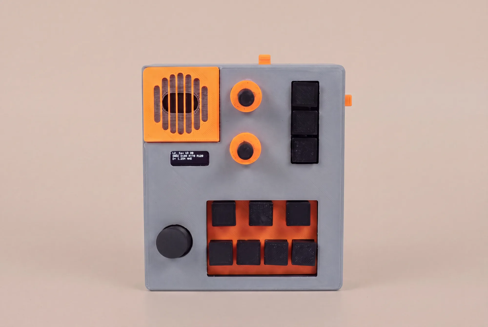
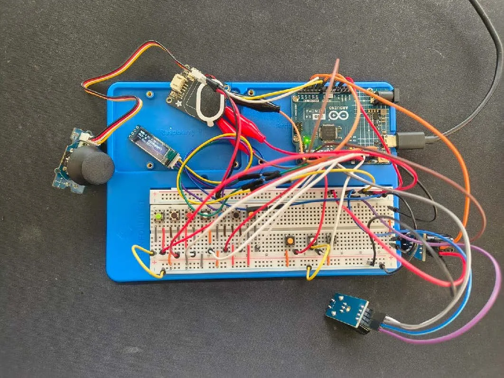
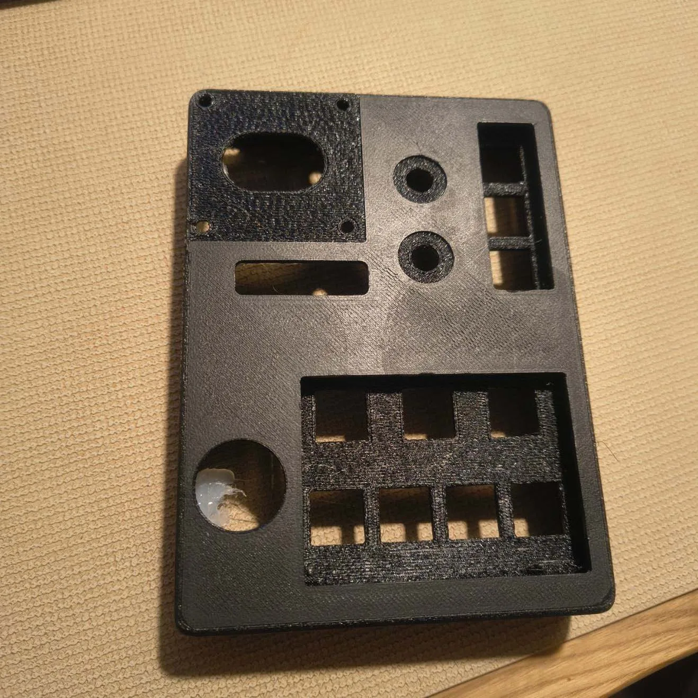
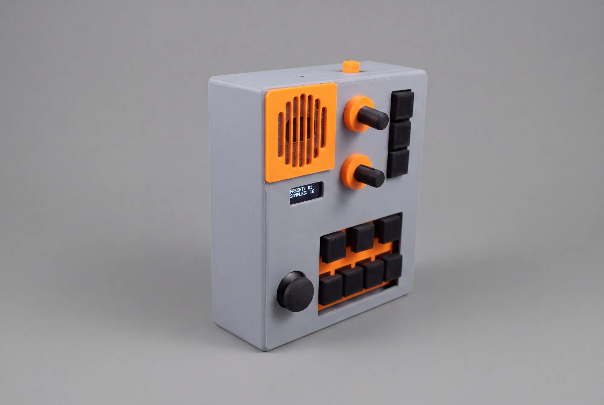

<h1 align="center">AudioDingo</h1>

<p align="center">
  A pocket-sized, battery-powered synthesizer built on the Arduino UNO R4 Minima and the Mozzi audio library.
</p>

<p align="center">
  
  
  
</p>

<p align="center">
  
</p>

AudioDingo is a standalone mini synth with seven note keys, three function buttons, two rotary encoders, a joystick and a small OLED display. It has a built-in speaker for playing on its own and a headphone/line jack for connecting to a larger synth setup. Everything sits in a custom 3D-printed enclosure designed in Fusion 360.

The full design process is documented on my blog: **[Development process of a DIY synthesizer](https://janwestphal.dev/blog/hello-blog/)**

## Demo

<p align="center">
  <a href="https://www.youtube.com/watch?v=iitkykF2S_k">
    
  </a>
  <br>
  <em>▶ Watch the demo on YouTube</em>
</p>

## Features

- **6 waveforms:** saw, pulse, triangle, sine, 2-operator FM and noise
- **Chord mode:** each key plays three voices (major, minor, sus4, octaves)
- **5 presets:** lead, bass, FM bell, sub and a sine kick drum
- **"Happy Accident" button:** generates a random patch
- **Resonant low-pass filter** with its own envelope
- **ADSR envelope** you can edit live with an encoder
- **Pitch envelope, LFO, bit crusher and noise layer**, defined per preset
- **Joystick performance controls:** vibrato, wah filter, bit crush and glide
- **128×32 OLED** status screen, plus an animated visualizer mode
- **Portable:** runs on a battery, with a built-in speaker and a headphone/line output

## Design process

The project went from a list of requirements through a simulation, breadboard prototypes and two enclosure iterations to the finished device.

1. **Requirements.** Seven note keys, because a scale has seven notes. Three function buttons and two encoders to shape the sound. A display for feedback. A speaker for standalone use, a jack for the rest of the setup, and a battery for portability.
2. **Simulation.** I tested a first version of the circuit on [Wokwi](https://wokwi.com/).
3. **Breadboard prototype.** I researched which components work together, then built and tested them on a breadboard.
4. **Enclosure v1.** I designed a case in Fusion 360 and printed only the main body, to check the layout with all parts installed.
5. **Iteration.** I soldered the electronics, moved the sound engine to Mozzi and redesigned the case to be wider and deeper, with revised button, cutout and connector dimensions. The second print fit.

<table>
  <tr>
    <td align="center" width="33%"><br><sub>Breadboard prototype</sub></td>
    <td align="center" width="33%"><br><sub>Enclosure design in Fusion 360</sub></td>
    <td align="center" width="33%"><br><sub>First test print of the case</sub></td>
  </tr>
</table>

## Hardware

<p align="center">
  
</p>

| Part | Notes |
|---|---|
| Arduino UNO R4 Minima | Outputs audio through its on-board 12-bit DAC on pin A0 |
| 7 push buttons | note keys |
| 3 push buttons | MODE, WAVE, CHORD |
| 2 rotary encoders | quadrature encoders with detents |
| Analog thumb joystick | 2 axes (X/Y) |
| SSD1306 OLED, 128×32, I²C | address `0x3C` |
| Small class-D amplifier + speaker | fed from A0 |
| Headphone / line jack | connects to other synths |
| Battery pack | for portable use |
| 3D-printed enclosure | see [`hardware/enclosure`](hardware/enclosure) |

All buttons connect between the pin and **GND**. The firmware enables the internal pull-up resistors, so you don't need external resistors.

### Pinout

| Pin | Function |
|---|---|
| D12, D11, D10, D9, D8, D7, D6 | Note keys C4 D4 E4 F4 G4 A4 B4 (low to high) |
| D3 | MODE button |
| A4 | WAVE button |
| A5 | CHORD button |
| D4, D5 | Encoder 1 (A, B) |
| D2, A3 | Encoder 2 (A, B) |
| A1, A2 | Joystick X, Y |
| A0 | Audio out (DAC) → amplifier |
| SDA, SCL | OLED display |

You can change every pin in [`firmware/AudioDingo/config.h`](firmware/AudioDingo/config.h).

### Hardware notes

- **Audio output:** On the UNO R4, Mozzi always plays audio through the internal DAC on **A0**. You can't move it to another pin. The firmware also defines A0 as `AMP_ENABLE_PIN`, but once Mozzi is running, the DAC controls the pin.
- **I²C pins:** On the UNO R4 Minima, **A4/A5 are the same pins as SDA/SCL**. In this build, the WAVE and CHORD buttons share these lines with the display. If you build your own, move these two buttons to free pins, e.g. D13 or D0/D1.

## Controls

| Control | Action |
|---|---|
| Note keys | Play a note (or a chord in chord mode) |
| Encoder 1 | Change the selected envelope value (A / D / S / R) |
| Encoder 1 + hold MODE | Select which envelope value to edit |
| Encoder 2 | Volume (1–15) |
| Encoder 2 + hold MODE | Select preset |
| Encoder 2 + hold CHORD | Octave shift −3…+3 (in chord mode) |
| MODE (tap) | Chord mode on/off |
| CHORD (tap) | Next chord type (chord mode) / random patch (otherwise) |
| WAVE (tap) | Next waveform |
| WAVE (hold 0.4 s) | Toggle visualizer screen |
| Joystick ↑ | Vibrato |
| Joystick ↓ | Close filter (wah) |
| Joystick → | Bit crush |
| Joystick ← | Glide / portamento |

### Display

```
Ld  Saw V8 O0          preset, waveform, volume, octave
[A5] D180 S170 R120    envelope; the value being edited is in [brackets]
Dt 1.004 RND           detune, "Crsh" when bit crush is on, chord type (RND = random-patch mode)
```

## How the sound engine works

Every note runs through this chain:

```
 oscillators ──► + noise ──► low-pass filter ──► × envelope ──► × volume ──► bit crush ──► DAC
 (1 or 3 voices)              ▲                    ▲
                              │                    │
             cutoff + filter envelope        amplitude ADSR
             + LFO + joystick
```

- **Oscillators:** Each voice has two oscillators. For saw, pulse and triangle, the second one is slightly detuned and the output is the difference of the two. As the oscillators drift in and out of phase, the waveform keeps changing. For FM, the second oscillator modulates the phase of the first, which produces bell-like and metallic sounds.
- **Control rate and audio rate:** Mozzi calls `updateControl()` 128 times per second to handle inputs, envelopes, pitch and the display. It calls `updateAudio()` 32,768 times per second, and each call computes one sample. The code comments explain why slow work belongs in the first function and only fast math in the second.
- **Click-free display:** An I²C transfer to the OLED briefly pauses audio generation. To avoid clicks, the status screen only redraws when a displayed value has changed.

## Building the firmware

1. Install the **Arduino IDE** (2.x) or `arduino-cli`.
2. Install the board package **Arduino UNO R4 Boards** (`arduino:renesas_uno`).
3. Install these libraries with the Library Manager. The versions listed are the ones I tested:

   | Library | Version |
   |---|---|
   | Mozzi | 2.0.4 |
   | Adafruit SSD1306 | 2.5.17 |
   | Adafruit GFX Library | 1.12.6 |
   | Adafruit BusIO | 1.17.4 (dependency) |
   | FixMath | 1.0.9 (Mozzi dependency) |

4. Open `firmware/AudioDingo/AudioDingo.ino`, select **Arduino UNO R4 Minima** and upload.

With `arduino-cli`:

```bash
arduino-cli compile --fqbn arduino:renesas_uno:minima firmware/AudioDingo
arduino-cli upload  --fqbn arduino:renesas_uno:minima -p <PORT> firmware/AudioDingo
```

## Customizing

| What | Where |
|---|---|
| Pins | `firmware/AudioDingo/config.h` |
| Scale of the note keys | `NOTE_MIDI_NUMBERS` in `config.h` |
| Sounds | `PRESETS[]` and `PRESET_NAMES[]` in `presets.h` (each field is documented in the `Preset` struct) |
| Chords | `CHORD_INTERVALS` in `presets.h` |

## Repository structure

```
├── firmware/AudioDingo/
│   ├── AudioDingo.ino   main program: sound engine, inputs, display, Mozzi callbacks
│   ├── config.h         pins and hardware constants
│   ├── presets.h        waveforms, presets and chord definitions
│   └── encoder.h        debounced rotary encoder decoder
├── hardware/enclosure/  3D-printable enclosure files
└── docs/images/         photos for this README
```

## Credits

- [Mozzi](https://github.com/sensorium/Mozzi) by Tim Barrass and contributors (LGPL-2.1)
- [Adafruit SSD1306](https://github.com/adafruit/Adafruit_SSD1306) and [Adafruit GFX](https://github.com/adafruit/Adafruit-GFX-Library) (BSD)

These libraries are not part of this repository. You install them separately, and their own licenses apply.

## License

[MIT](LICENSE) © 2026 Jan Westphal: firmware, enclosure files and documentation.

---

<p align="center">
  Built by <a href="https://janwestphal.dev">Jan Westphal</a>
</p>
