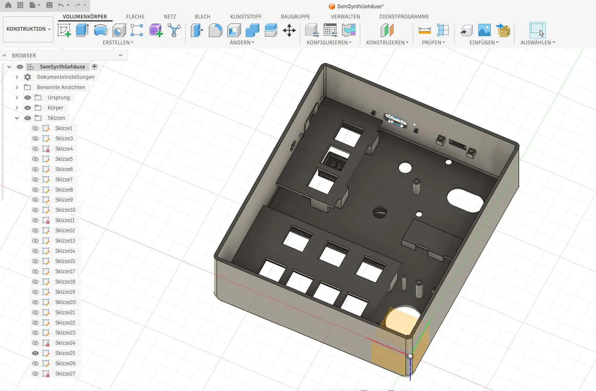

# Enclosure

3D-printable enclosure for AudioDingo, designed in Fusion 360.

  

The case is printed in several colors: a grey main body, orange accents and black caps.

## Files

Place the print files (`.stl` / `.3mf`) and, optionally, the Fusion 360 source (`.f3d`) in this folder.
